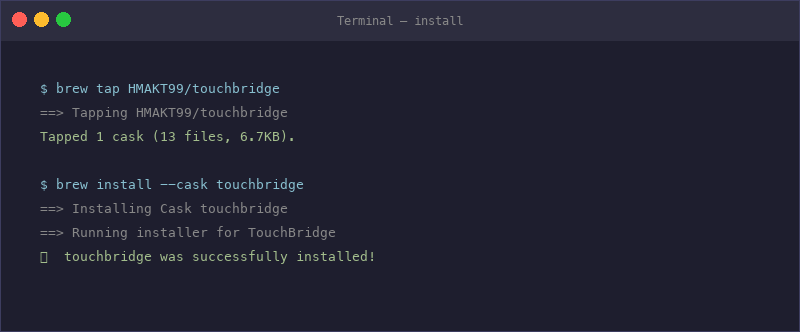
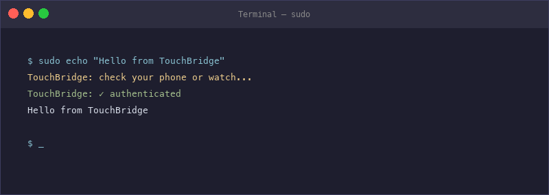
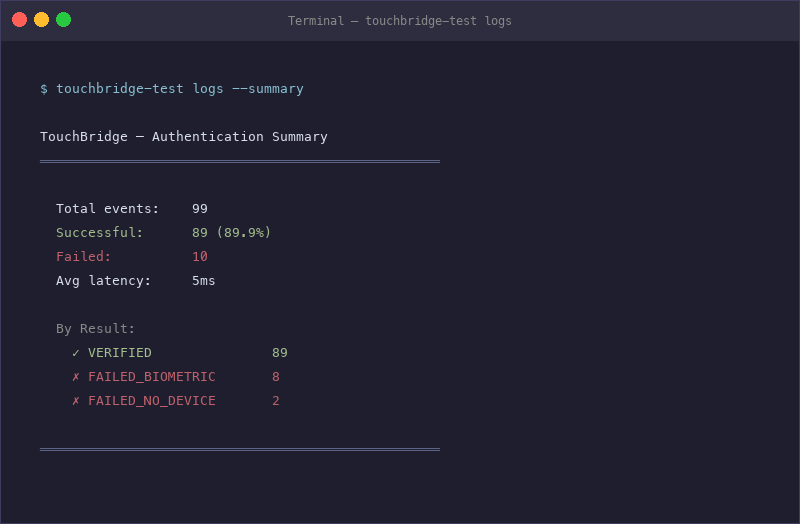

<p align="center">
  <h1 align="center">🔐 TouchBridge</h1>
  <p align="center">
    <a href="https://github.com/whjvenyl/touch-bridge/stargazers"></a>
    <a href="LICENSE"></a>
    <a href="https://github.com/whjvenyl/touch-bridge/releases"></a>
    
    
  </p>
  <p align="center">
    <strong>Approve macOS auth prompts from the device next to you.</strong><br>
    sudo, screensaver, App Store — from your phone or watch, not your Mac's Touch ID.
  </p>
  <p align="center">
    Works with <strong>iPhone · Android · Apple Watch · Wear OS</strong>
  </p>
  <p align="center">
    <a href="#try-it-in-60-seconds">Try it in 60 seconds</a> •
    <a href="#how-it-works">How It Works</a> •
    <a href="#every-device-supported">Devices</a> •
    <a href="SECURITY.md">Security</a>
  </p>
</p>

<p align="center">
  <video src="https://github.com/user-attachments/assets/65ea3c2f-7bf9-4272-b475-f8a387de3c7b" width="700" autoplay loop muted playsinline></video>
</p>

---

### The Problem

Your Mac has Touch ID. But it's not always where you are.

The sensor is built into the keyboard or the lid — but your Mac is under your desk, behind a monitor, across the room. Every time you run `sudo`, you reach for it. Or you type your password instead. Over and over. All day.

And if your Mac *doesn't* have Touch ID — Mac Mini, Mac Studio, Mac Pro, iMac with the base keyboard, the base-model MacBook Neo — you're typing your password every single time. Apple's fix is $199 for a Magic Keyboard with Touch ID. Or $100 to upgrade to the MacBook Neo variant that has it.

### The Solution

**TouchBridge routes the auth prompt to the device that's already next to you.** Your phone is on your desk. Your watch is on your wrist. TouchBridge sends the prompt there — you glance, tap, done. No reaching for the Mac. No typing your password.

```
$ sudo echo hello
  → Phone buzzes
  → Touch fingerprint (or tap Watch)
  → ✓ Authenticated
```

---

## Try It in 60 Seconds

No phone needed. Test the full `sudo` flow right now:

### Option A — Menu Bar App (recommended)

Download the latest `TouchBridge.dmg` from [releases](https://github.com/whjvenyl/touch-bridge/releases), drag to Applications, and open it. The app bundles everything — daemon, PAM module, and a privileged helper for one-click install. No terminal needed.

### Option B — Homebrew (CLI only)

<p align="center">
  
</p>

```bash
brew tap whjvenyl/touchbridge
brew install --cask touchbridge
sudo bash /usr/local/share/touchbridge/patch-pam.sh
```

### Or build from source

```bash
git clone https://github.com/whjvenyl/touch-bridge.git
cd touch-bridge
bash scripts/build-all.sh release
sudo bash scripts/install.sh
```

### Try it

<p align="center">
  
</p>

```bash
# Terminal 1 — start daemon in simulator mode
touchbridge serve --simulator

# Terminal 2 — test sudo
sudo echo 'It works!'
# → TouchBridge: check your phone or watch...
# → TouchBridge: ✓ authenticated
# → It works!
```

**That's it.** Undo anytime with `sudo bash scripts/uninstall.sh`.

---

## Every Device Supported

| Device | How | Auth Method | App Required? |
|--------|-----|-------------|--------------|
| **iPhone** | BLE → Face ID / Touch ID | Secure Enclave signing | iOS app |
| **Android phone** | BLE → Fingerprint / Face | Keystore (StrongBox/TEE) | Android app |
| **Apple Watch** | iPhone relay → Tap to approve | iPhone Secure Enclave | watchOS app |
| **Wear OS watch** | Phone relay → Tap to approve | Phone Keystore | Wear OS app |
| **No device** | Simulator → Auto-approve | Software keys | **No** |

> **Security note:** All companion modes use **encrypted Bluetooth** with ECDH session keys and AES-256-GCM — no Wi-Fi, no network, no cloud.

### Use with your phone

**Option A — iPhone (Face ID) — recommended for security:**
```
Open companion/ios/TouchBridge.xcodeproj in Xcode → Build → Run on iPhone
Open the TouchBridge menu bar app → Pair New Device → scan QR with the app
```
Pairing uses a single-use token (expires in 5 minutes) — the Mac rejects any device without it. Encrypted BLE + Secure Enclave signing; no network involved.

**Option B — Android (Fingerprint):**
```
Open companion/android/ in Android Studio → Build → Install → Pair
```
Uses encrypted BLE + Keystore (StrongBox/TEE) signing. No network involved.

:::warning
**Android status:** The Android companion has known protocol incompatibilities (wire format headers, Base64 encoding, missing identify message). See the [Architecture Review](design/ARCHITECTURE-REVIEW.md) for details. iOS is the recommended companion for now.
:::

**Option C — Apple Watch (Tap):**
```
Build the watchOS target from companion/ios/TouchBridge.xcodeproj
Challenges relay from iPhone → Watch → tap Approve
```

**Option D — Wear OS (Tap):**
```
Open companion/android/wear/ in Android Studio → Build → Install on watch
Challenges relay from Android phone → Watch → tap Approve
```

---

## How It Works

```
┌──────────────┐         BLE / Wi-Fi         ┌──────────────┐
│              │  ──── challenge (nonce) ───→ │              │
│   Your Mac   │                              │  Your Phone  │
│              │  ←── signed response ──────  │  or Watch    │
│  (daemon)    │                              │              │
│              │     ECDSA P-256 signature    │              │
└──────────────┘     verified on Mac          └──────────────┘
       ↑
       │ Unix socket
┌──────────────┐
│  sudo / PAM  │
└──────────────┘
```

1. You run `sudo` → PAM loads `pam_touchbridge.so`
2. PAM module connects to daemon via Unix socket
3. Daemon sends 32-byte random nonce to your device
4. Device prompts biometric (Face ID / fingerprint / tap)
5. Device's secure hardware signs the nonce (private key never leaves chip)
6. Daemon verifies signature → `sudo` proceeds
7. If device is unreachable → **falls through to normal password prompt**

---

## What Can It Do?

| Action | Status | Notes |
|--------|--------|-------|
| **`sudo` commands** | ✅ Verified | PAM module — tested on real hardware |
| **Screensaver unlock** | ✅ Ready | PAM module |
| **App Store purchases** | 🔧 Planned | Authorization Plugin (code written) |
| **System Settings auth** | 🔧 Planned | Authorization Plugin |
| **Lock when phone walks away** | ✅ Ready | `--auto-lock` flag |
| **Audit log** | ✅ Ready | `touchbridge logs` |
| **Per-action policy** | ✅ Ready | `touchbridge config` |

### What it cannot do (honestly)

| Limitation | Why |
|-----------|-----|
| Apple Pay | Dedicated hardware — impossible |
| FileVault unlock | Before macOS boots — no daemon |
| Login screen | Daemon starts after login |
| Keychain biometric items | Hardware crypto wall — impossible |
| 1Password/Bitwarden biometric | SIP sandbox — can't intercept |

---

## How is this different from Passkeys?

Apple's built-in Passkeys already use Face ID on your iPhone to log into websites. So why TouchBridge?

**Passkeys replace your website passwords. TouchBridge replaces your Mac password.**

| | Apple Passkeys (built-in) | TouchBridge |
|---|---|---|
| **What it does** | Log into websites (Gmail, GitHub, etc.) | Authenticate on macOS (sudo, screensaver, App Store) |
| **Where it works** | Safari/Chrome — websites that support Passkeys | Terminal, lock screen, system dialogs, any `sudo` command |
| **Can it do `sudo`?** | ❌ No | ✅ Yes |
| **Can it unlock screensaver?** | ❌ No | ✅ Yes |
| **Can it do App Store?** | ❌ No | ✅ Yes |
| **Can it do website login?** | ✅ Yes | Use Apple Passkeys / your password manager |
| **How it connects** | Scan QR code each time | Auto-connects via BLE (pair once) |
| **Android support** | ❌ No | ✅ Yes |
| **Works offline** | ❌ Needs website | ✅ Local BLE |

They're complementary — you'd use both. Passkeys for the web. TouchBridge for your Mac.

---

## Compared to Alternatives

| | TouchBridge | Magic Keyboard | Apple Watch | YubiKey Bio | Duo Security |
|---|---|---|---|---|---|
| **Price** | **Free** | $199-$299 | $249+ | $80+ | $3-9/user/mo |
| **sudo** | ✅ | ✅ | ❌ | ✅ | ✅ |
| **Biometric** | ✅ Face ID/FP | ✅ Fingerprint | ❌ Wrist only | ✅ Fingerprint | ❌ Tap only |
| **Wireless** | ✅ BLE | ❌ Wired only | ✅ | ❌ USB | ✅ Cloud |
| **Works at coffee shop** | ✅ | ❌ | Sleep only | ✅ | ✅ |
| **Android support** | ✅ | ❌ | ❌ | ❌ | ✅ |
| **No extra hardware** | ✅ Use your phone | ❌ $199 keyboard | ❌ $249 watch | ❌ $80 key | ✅ |
| **No cloud/internet** | ✅ Local BLE | ✅ | ✅ | ✅ | ❌ Cloud required |
| **Open source** | ✅ | ❌ | ❌ | ❌ | ❌ |
| **Auto-lock on walk away** | ✅ | ❌ | ❌ | ❌ | ❌ |
| **Audit log** | ✅ | ❌ | ❌ | ❌ | ✅ |

**For desktop Mac users**: Magic Keyboard is $199 and wired. YubiKey is another thing to carry. Apple Watch can't do sudo. Duo needs internet. **TouchBridge uses the phone already on your desk.**

---

## All Daemon Modes

| Mode | Command | Use case |
|------|---------|----------|
| **Production** | `touchbridge serve` | iPhone/Android via BLE |
| **Simulator** | `touchbridge serve --simulator` | Testing, CI, demos |
| **Interactive** | `touchbridge serve --interactive` | Terminal approve/deny |
| **Auto-lock** | `touchbridge serve --auto-lock` | Lock when phone leaves |

Flags can be combined: `touchbridge serve --simulator --auto-lock`

---

## Configuration & Audit Log

<p align="center">
  
</p>

```bash
touchbridge config show                          # view policy
touchbridge config set --surface sudo --mode biometric_required
touchbridge config set --surface screensaver --mode proximity_session --ttl 30
touchbridge config reset                         # restore defaults
touchbridge logs                                 # recent auth events
touchbridge logs --summary                       # analytics dashboard
touchbridge logs --failures                      # failed attempts only
touchbridge logs --export csv                    # export for security review
```

---

## Supported Macs

Any Mac running **macOS 13+** (Ventura or later). TouchBridge works whether your Mac has Touch ID or not — the point is approving from what's next to you, not reaching for the Mac.

| Mac | Why TouchBridge |
|-----|----------------|
| **Mac Mini / Mac Studio / Mac Pro** | No Touch ID — and the Mac is under your desk anyway |
| **iMac** (base keyboard) | No Touch ID unless you paid for the upgraded keyboard |
| **MacBook Neo** (base model) | No Touch ID on the base model — pay $100 more for it |
| **Any MacBook with Touch ID** | Sensor is in the lid — inconvenient when docked to external monitor |
| **Any Mac with a broken sensor** | Sensor failure — repair costs $300+ |
| **Intel Macs with T2** (2018-2020) | Works with Secure Enclave on Mac side |

---

## Security

Private keys **never leave** Secure Enclave (iPhone) / StrongBox (Android). 32-byte nonces, 10s expiry, replay protection, AES-256-GCM encrypted BLE. Full threat model: [design/security-model.md](design/security-model.md)

## Architecture

| Component | Language | Location |
|-----------|----------|----------|
| `touchbridge` | Swift | `mac/daemon/` |
| `pam_touchbridge.so` | C (arm64 + x86_64) | `mac/pam/` |
| TouchBridgeProtocol | Swift | `protocol/swift/` |
| Menu bar app + privileged helper | Swift / SwiftUI | `mac/menubar/` |
| iOS + watchOS app | Swift / SwiftUI | `companion/ios/` |
| Android + Wear OS app | Kotlin / Compose | `companion/android/` |

The menu bar app bundles the daemon binary, PAM module, and a privileged helper (via `SMAppService.daemon`) for one-click install — no terminal needed. Homebrew install is available for CLI-only users.

**112 tests** — crypto, socket server, PAM integration, E2E pipeline.

### Repository structure

```
protocol/swift/     # Shared wire protocol (SwiftPM)
mac/daemon/         # macOS daemon (SwiftPM)
mac/pam/            # PAM module (C)
mac/menubar/        # Menu bar control app (Xcode)
mac/authplugin/     # Authorization plugin (stub)
companion/ios/      # iOS + watchOS companion (Xcode)
companion/android/  # Android + Wear OS companion (Gradle)
docs/               # Blume documentation site
design/             # Architecture review, security model, ADRs
scripts/            # Build, install, uninstall scripts
```

### Build

```bash
bash scripts/build-all.sh          # build everything (debug)
bash scripts/build-all.sh release  # release build
bash scripts/build-all.sh test     # build + run tests
```

### Documentation

```bash
bash scripts/docs.sh dev    # docs dev server at localhost:4321
bash scripts/docs.sh build  # static build to docs/dist/
```

See the [architecture review](design/ARCHITECTURE-REVIEW.md) for a full audit of what's built, what's broken, and what needs work.

## Uninstall

**Menu bar app:** Settings → General → Uninstall TouchBridge

**Homebrew:** `brew uninstall --cask touchbridge`

**From source:** `sudo bash scripts/uninstall.sh`

## Contributing

[CONTRIBUTING.md](CONTRIBUTING.md) — PRs welcome.

## License

[MIT](LICENSE)

---

---

## Why TouchBridge Exists

Your Mac may have Touch ID, but it's not always within reach. Your phone is. Your watch is. TouchBridge bridges that gap — routing macOS auth prompts to the device that's already next to you. Local, private, free, open source.

<p align="center">
  <strong>Stop reaching for your Mac. Approve from what's next to you.</strong><br>
  <a href="#try-it-in-60-seconds">Get started in 60 seconds →</a>
</p>
