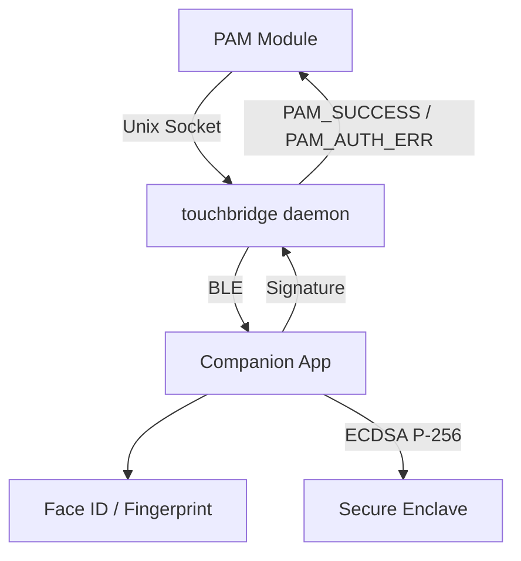

# Architecture

## Component Overview

## Data Flow: sudo authentication

<Steps>
  <Step title="sudo triggers PAM">User runs `sudo echo test`. PAM loads `pam_touchbridge.so`.</Step>
  <Step title="PAM connects to daemon">PAM module connects to daemon socket at `~/Library/Application Support/TouchBridge/daemon.sock`.</Step>
  <Step title="Daemon issues challenge">SocketServer receives request → `DaemonCoordinator.authenticateFromPAM()` → ChallengeManager generates 32-byte nonce with 10s expiry.</Step>
  <Step title="Challenge sent over BLE">Nonce encrypted with AES-256-GCM (ECDH session key) and sent via BLE to the companion device.</Step>
  <Step title="Companion prompts biometric">CompanionCoordinator receives, decrypts, shows Face ID prompt via LAContext.</Step>
  <Step title="Secure Enclave signs">On success, SecureEnclaveManager signs nonce with ECDSA P-256. Private key never leaves the Secure Enclave.</Step>
  <Step title="Signature returned">Signature sent back via BLE to the daemon.</Step>
  <Step title="Daemon verifies">ChallengeManager verifies signature against the pinned public key stored in macOS Keychain.</Step>
  <Step title="PAM returns result">Result returned through continuation → SocketServer → PAM module. PAM returns `PAM_SUCCESS` or `PAM_AUTH_ERR`.</Step>
</Steps>

:::note
If the companion device is unreachable, denies the request, or times out, TouchBridge falls through to the normal password prompt. You are never locked out.
:::
