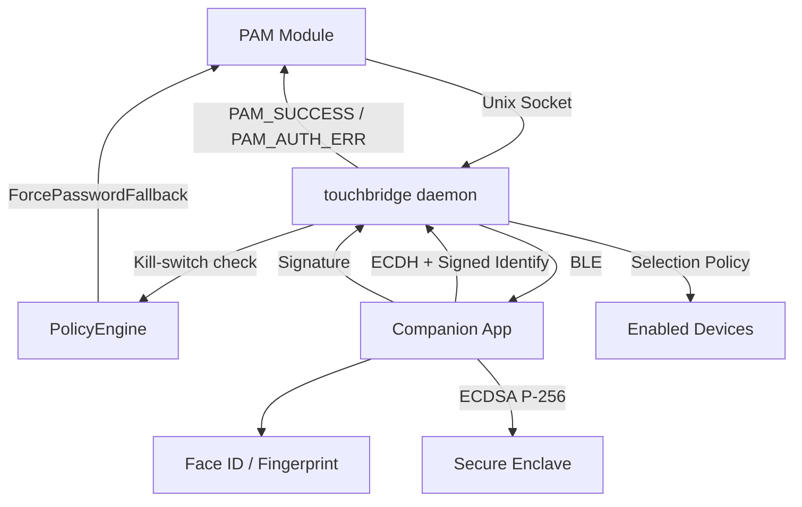

# Architecture

## Component Overview

## Data Flow: sudo authentication

<Steps>
  <Step title="sudo triggers PAM">User runs `sudo echo test`. PAM loads `pam_touchbridge.so`.</Step>
  <Step title="PAM connects to daemon">PAM module connects to daemon socket at `~/Library/Application Support/TouchBridge/daemon.sock`.</Step>
  <Step title="Kill-switch check">`DaemonCoordinator.authenticateFromPAM()` checks `PolicyEngine.forcePasswordFallback()`. If active, returns immediately — PAM falls through to password.</Step>
  <Step title="Target selection">Daemon filters connected sessions: must have ECDH session + identified device + enabled in `DeviceRuntimeStore`. Selection policy (`anyOneOf` or `priorityOrder`) determines dispatch order.</Step>
  <Step title="Daemon issues challenge">ChallengeManager generates 32-byte nonce with 10s expiry. Challenge encrypted with AES-256-GCM (ECDH session key) and sent via BLE.</Step>
  <Step title="Companion prompts biometric">CompanionCoordinator receives, decrypts, shows Face ID prompt via LAContext.</Step>
  <Step title="Secure Enclave signs">On success, SecureEnclaveManager signs nonce with ECDSA P-256. Private key never leaves the Secure Enclave.</Step>
  <Step title="Watch delegation check">If the responding device is a WATCH without secure enclave, the daemon rejects the response — the watch must delegate to its paired phone.</Step>
  <Step title="Signature returned">Signature sent back via BLE to the daemon.</Step>
  <Step title="Daemon verifies">ChallengeManager verifies signature against the pinned public key stored in macOS Keychain.</Step>
  <Step title="PAM returns result">Result returned through continuation → SocketServer → PAM module. PAM returns `PAM_SUCCESS` or `PAM_AUTH_ERR`.</Step>
</Steps>

:::note
If the companion device is unreachable, denies the request, or times out, TouchBridge falls through to the normal password prompt. You are never locked out.
:::

## Device Connection Flow

<Steps>
  <Step title="BLE connect">Companion connects to Mac's BLE peripheral.</Step>
  <Step title="ECDH key exchange">Both sides generate ephemeral P-256 keys, exchange public keys, derive shared secret via HKDF-SHA256 → AES-256-GCM session key.</Step>
  <Step title="Signed identify">Companion sends `Identify` message with `deviceID`, `deviceName`, `deviceType`, and `signature` (ECDSA of `deviceID || daemonEphemeralPubKey`). Daemon verifies signature against pinned public key from Keychain.</Step>
  <Step title="Session identified">If signature is valid and deviceID is known, the session is marked as identified and can receive challenges.</Step>
</Steps>

## Selection Policy

| Mode | Behavior | Default |
|------|----------|---------|
| `anyOneOf` | Broadcast to all enabled, identified devices. First response wins. | Yes |
| `priorityOrder` | Try devices in priority order (lower = first). Each gets `globalTimeout / N` seconds. | No |

Disabled devices (via `DeviceRuntimeStore`) are always excluded from auth regardless of mode.

## Device Types

| Type | Description | Can sign directly? |
|------|-------------|-------------------|
| `PHONE` | iPhone, Android phone | Yes (has SEP + biometric) |
| `WATCH` | Apple Watch, Wear OS | Only if `hasSecureEnclave = true` |
| `RING` | Smart ring | No (must delegate to phone) |
| `TABLET` | iPad, Android tablet | Yes (same as phone) |
